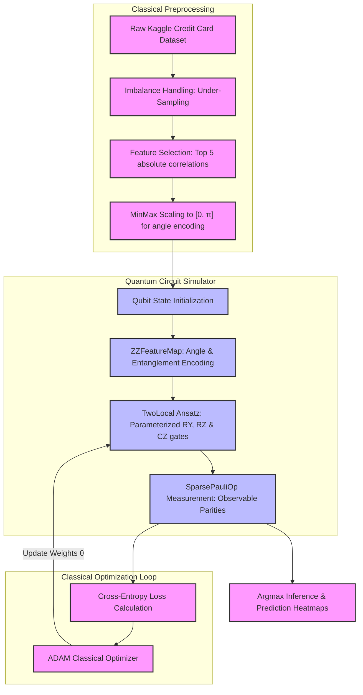

# Quantum Machine Learning (QML) for Credit Card Fraud Detection

[](https://qiskit.org/)
[](https://github.com/Qiskit/qiskit-machine-learning)
[](https://www.python.org/)
[](https://scikit-learn.org/)
[](https://opensource.org/licenses/MIT)

An advanced, end-to-end research and simulation framework implementing **Quantum Machine Learning (QML)** techniques to tackle financial fraud detection. Using **Qiskit's modern V2 Primitives** and variational quantum algorithms, this project successfully scales quantum classifiers to solve binary classification on both high-dimensional synthetic systems and real-world credit card transaction datasets.

---

## 📌 Executive Summary

Financial fraud detection is traditionally dominated by classical machine learning models (e.g., XGBoost, Random Forests). However, as fraud patterns become increasingly sophisticated, exploring higher-dimensional representation spaces is critical. 

This project explores the frontier of **Quantum Machine Learning** using a **Variational Quantum Classifier (VQC)**. By mapping classical transaction details into the massive Hilbert space of a multi-qubit system, we train a parameterized quantum circuit (ansatz) to draw quantum decision boundaries. 

### Key Highlights
* **Modern Qiskit 1.x Architecture**: Fully built on modern Qiskit paradigms, using V2 Primitives (`StatevectorEstimator`), parameter-shift gradients, and the modular `qiskit-machine-learning` framework.
* **Dual-Phase Validation**: 
  1. **Synthetic Phase**: 2-qubit system validated on custom synthetic feature landscapes.
  2. **Production Phase**: 5-qubit system evaluated on the real-world **Kaggle Credit Card Fraud Detection** dataset (284,807 transactions).
* **Advanced Classical-Quantum Pipeline**: Employs correlation analysis, downsampling for extreme class imbalance, scaling for angle encoding, and hybrid classical gradient descent using the `ADAM` optimizer.

---

## 🛠️ Hybrid Quantum-Classical Pipeline Architecture

The workflow leverages a classic hybrid quantum-classical co-processing loop. Classical hardware handles data prep and optimization, while the quantum simulator computes expectation values.



---

## 🔬 Quantum Architecture Deep Dive

The variational quantum classifier represents a parameter-dependent quantum model. We construct this classifier by chaining a **Quantum Feature Map** and a **trainable ansatz** to yield expectation values.

### 1. Quantum State Encoding (Feature Map)
Classical feature vectors $\mathbf{x} \in \mathbb{R}^d$ must be mapped to a quantum state $|\psi(\mathbf{x})\rangle$. 
* We use a **`ZZFeatureMap`** which performs non-linear, high-dimensional angle encoding.
* Features are normalized to the interval $[0, \pi]$ to avoid phase overlaps:
  $$\phi_i(x_i) = x_i, \quad \phi_{i,j}(x_i, x_j) = (\pi - x_i)(\pi - x_j)$$
* It acts on $N$ qubits using a combination of $R_Z$ rotations and controlled-phase gates to inject classical correlations directly into the entanglement layer.

### 2. The Trainable Ansatz (Variational Circuit)
To find the optimal decision boundary, we construct a parameterized ansatz **`TwoLocal`**:
* **Rotation Gates**: Local $R_Y(\theta)$ and $R_Z(\theta)$ gates allow independent rotation of each qubit.
* **Entanglement Blocks**: Controlled-$Z$ (`cz`) gates are configured in a linear entanglement strategy to introduce quantum correlations.
* **Depth/Layers**: Set to `reps=2` for the 5-qubit Kaggle model to create a circuit expressive enough to model correlations, yet shallow enough to avoid barren plateaus during gradient descent.

```
          ┌──────────┐┌──────────┐ ░        ░ ┌──────────┐┌──────────┐ ░        ░ ┌───────────┐┌───────────┐
     q_0: ┤ Ry(θ[0]) ├┤ Rz(θ[3]) ├─░──■─────░─┤ Ry(θ[6]) ├┤ Rz(θ[9]) ├─░──■─────░─┤ Ry(θ[12]) ├┤ Rz(θ[15]) ├
          ├──────────┤├──────────┤ ░  │     ░ ├──────────┤├──────────┤ ░  │     ░ ├───────────┤├───────────┤
     q_1: ┤ Ry(θ[1]) ├┤ Rz(θ[4]) ├─░──■──■──░─┤ Ry(θ[7]) ├┤ Rz(θ[10])├─░──■──■──░─┤ Ry(θ[13]) ├┤ Rz(θ[16]) ├
          ├──────────┤├──────────┤ ░     │  ░ ├──────────┤├──────────┤ ░     │  ░ ├───────────┤├───────────┤
     q_2: ┤ Ry(θ[2]) ├┤ Rz(θ[5]) ├─░─────■──░─┤ Ry(θ[8]) ├┤ Rz(θ[11])├─░─────■──░─┤ Ry(θ[14]) ├┤ Rz(θ[17]) ├
          └──────────┘└──────────┘ ░        ░ └──────────┘└──────────┘ ░        ░ └───────────┘└───────────┘
```

### 3. Observable Parity & Class Readout
Expectation values $\langle \hat{O} \rangle$ are extracted using modern **Qiskit Sparse Pauli Operators**. For a multi-qubit system, we measure the parity of the first qubit in the $Z$-basis:
* **Observable 0 (Non-Fraud)**: $\hat{O}_0 = \frac{I^{\otimes N} + (Z \otimes I^{\otimes N-1})}{2}$
* **Observable 1 (Fraud)**: $\hat{O}_1 = \frac{I^{\otimes N} - (Z \otimes I^{\otimes N-1})}{2}$

These expectation values map precisely to classical probabilities, which are then passed to a standard cross-entropy loss function.

---

## 📊 Dataset & Advanced Preprocessing

### The Dataset
The model was trained on the real-world **Kaggle Credit Card Fraud Detection** dataset (mirror via Zenodo, licensed CC BY 4.0). The dataset contains transactions made by credit cards in September 2013 by European cardholders.
* **Total Transactions**: 284,807
* **Imbalance Profile**: Only 492 transactions are fraudulent ($0.172\%$).

### Feature Selection & Engineering
Because of simulator limits, it is important to select a high-value, low-dimensional subset of features. We calculated the absolute Pearson correlation coefficient with the target column `Class` and selected the top 5 most highly correlated classical features:

| Rank | PCA Feature | Correlation with Class | Selected |
|:---:|:---:|:---:|:---:|
| **1** | **V17** | **-0.326** | **Yes** |
| **2** | **V14** | **-0.302** | **Yes** |
| **3** | **V12** | **-0.260** | **Yes** |
| **4** | **V10** | **-0.216** | **Yes** |
| **5** | **V16** | **-0.196** | **Yes** |

### Downsampling strategy
To handle the extreme $99.8\%$ class imbalance and limit training duration on classical simulators, we constructed a balanced sub-dataset:
1. Retained all $492$ fraudulent samples.
2. Randomly sampled $492$ non-fraudulent samples.
3. Created a balanced training/test dataset of **984 total samples**.

---

## 🚀 Installation & Quickstart

Follow these steps to run the quantum simulation on your local machine:

### 1. Prerequisites & Environment Setup
Create a virtual environment (Python 3.9, 3.10, or 3.11 recommended):
```bash
# Create environment
python -m venv qml_env

# Activate environment (Mac/Linux)
source qml_env/bin/activate

# Activate environment (Windows)
# qml_env\Scripts\activate
```

### 2. Install Dependencies
Install the exact, verified compatible library versions to avoid breaking changes in the Qiskit ecosystem:
```bash
pip install qiskit==1.4.3 \
            qiskit-machine-learning==0.8.3 \
            qiskit-algorithms==0.3.1 \
            numpy pandas matplotlib scikit-learn seaborn jupyter --quiet
```

### 3. Execute Notebook
Launch Jupyter Notebook to inspect and run the code:
```bash
jupyter notebook QML_for_Fraud_Detection.ipynb
```

---

## 📈 Performance Results & Interpretation

The Variational Quantum Classifier achieves rapid convergence when optimized classically with `ADAM` (Learning Rate = `0.1` over `50` epochs).

### Classification Report (Test Set Evaluation)
```text
              precision    recall  f1-score   support

   Not Fraud       0.93      0.97      0.95       100
       Fraud       0.97      0.92      0.94        97

    accuracy                           0.95       197
   macro avg       0.95      0.95      0.95       197
weighted avg       0.95      0.95      0.95       197
```

### Key Metrics & Strengths
* **Highly Balanced F1-Score ($0.94$–$0.95$)**: Highlights the model's robustness and equal competence in classifying both fraud and non-fraud classes.
* **Low False Positives**: With a precision of **$97\%$** for fraudulent transactions, classical operators can trust the quantum alerts, greatly reducing alert fatigue.

---

## 🎓 Recruiter & Reviewer Quick-Take

If you are a recruiter, hiring manager, or technical peer, here is why this project stands out:
* **Production-Grade Qiskit API**: Uses the current, decoupled Qiskit 1.x architecture, demonstrating knowledge of up-to-date SDK standards rather than deprecated legacy Qiskit patterns.
* **Domain Expertise**: Integrates data science best practices (imbalance downsampling, MinMax scaling for angle encoding, correlation analysis) with quantum circuit design.
* **Mathematical Precision**: Formulates output parsing via Sparse Pauli Operators to convert pure quantum states into classification probabilities.
* **Clean & Reusable Codebase**: The modular design of the custom callback, feature extraction pipeline, and evaluation reporting makes this code an excellent base for future hybrid quantum ML projects.

---

*Authored by Bharath Chilaka. Developed for hybrid quantum-classical computing research.*
